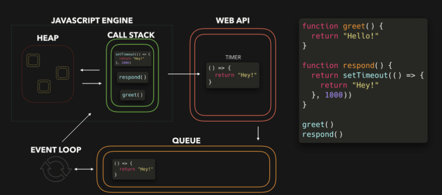

## What is Event Loop

The Event Loop is an important concept in JavaScript runtime environments, particularly in browsers and Node.js. It manages the execution order of asynchronous operations, callback functions, and events. We could say event loop is actually a mechanism , with this mechanism enables JavaScript to handle asynchronous operations within a single thread while maintaining relatively good performance and responsiveness.

Although there are some differences in the event loop between Node.js and browsers, the core concept remains similar. Understanding the event loop is crucial for writing efficient, non-blocking JavaScript code, especially when dealing with numerous I/O operations and asynchronous tasks.

## How Event Loop works

When running an program in browser, the computer not only help us create a heap and call stack for us, where we used running our code, we can also call it main thread, but also create two queues, one of them is Web API, another is Event Queue, and task queue and microtask queue are included in Event Queue.

- Web API
- Event Queue: for all those asynchronous task should be in event queue, waiting to be called 
  - macro task queue
  - microtask queue

1. First of all, main thread would execute the code from top to bottom, if meet any asynchronous task, just put it into Web API to monitor, will not prevent the main thread to run the synchronous code from top to bottom.

2. When any monitored asynchronous task in WEB API is ready to run, it won't execute immediately, instead was moved to Event Queue to wait to be called. 
   - There are 2 queues in Event Queue depends on micro task or macro task (task)
   - First-In-First-Out, who first comes into the queue would be first called in their own task queue.
   - So, for many timer tasks, we do set up a timer. However, when the  scheduled time is reached, it doesn't necessarily run immediately. The  scheduled time merely places the task in the queue, waiting its turn,  rather than executing it immediately.
   -  Microtasks always take priority over macro tasks

3. When all synchronous tasks have been executed and completed, the main thread becomes available. The microtask queue is then processed on the main thread if there are microtasks in the micro queue, they are executed one by one. If there are no microtasks, the event loop checks for any pending macro tasks in the task queue and executes them. After processing one macro tasks, the event loop returns to the microtask queue to check if there are any remaining microtasks. This emphasizes that microtasks always take priority over macro tasks. Macro tasks are executed only when the microtask queue is empty. For those tasks of the same level are processed in a first-in-first-out manner.

   

## Micro or Macro

### **Macro tasks (Macrotasks):**

1. `setTimeout` and `setInterval`: Timer tasks.
2. I/O operations: Such as file read/write, network requests.
3. Page rendering: Updating DOM elements.
4. User interaction events: Clicks, inputs, etc.
5. Event callbacks: Handling event listeners.
6. Request animation frame: `requestAnimationFrame`.

### **Micro tasks (Microtasks):**

1. `Promise`'s `then` and `catch`: Handling the results of Promise objects.
2. `async/await`: Code following `await` is treated as a microtask after the Promise is resolved.
3. `MutationObserver`: Observing DOM changes.
4. `queueMicrotask`: Adding a task to the microtask queue.

Key points to note:

- Micro tasks are executed immediately after the current macro task finishes. They have a higher priority.
- Micro tasks are commonly used to handle Promise results and other tasks that need to be executed as soon as possible within the current event loop.
- Macro tasks are executed after micro tasks, only when the current task queue is empty.

Please keep in mind that the list provided is not exhaustive, and the specific macro tasks and micro tasks may vary depending on the JavaScript runtime environment (such as browsers, Node.js). Understanding the execution order of macro tasks and micro tasks is crucial for writing effective asynchronous code.

### Reference

https://dev.to/lydiahallie/javascript-visualized-event-loop-3dif